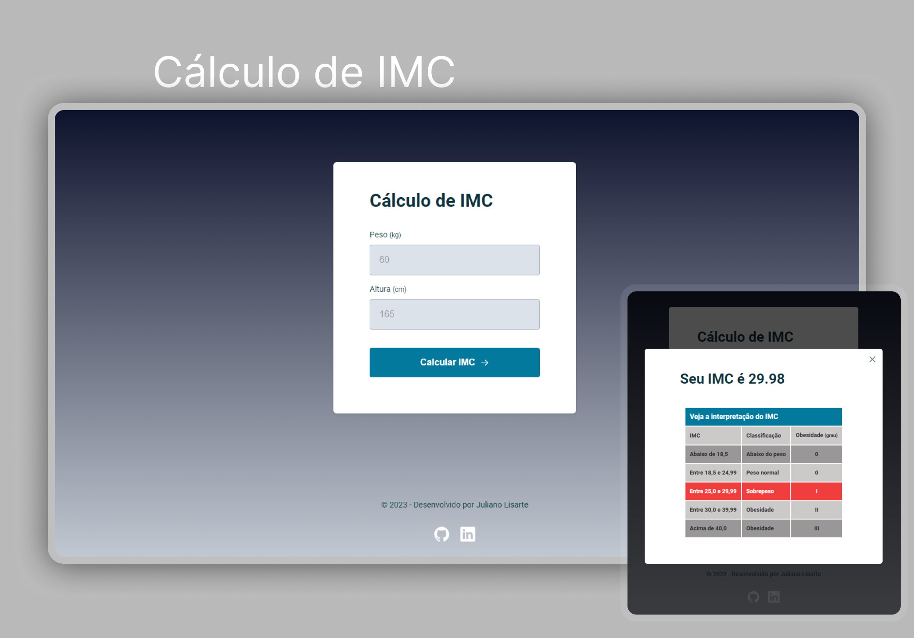

  

<h1 align="center">Desafio Biscoito da Sorte - Projeto do Explorer - Rocketseat</h1>

 

  
  <a href="https://jlisarte.github.io/projeto_projeto_biscoitodasorte/" target="_blank">https://jlisarte.github.io/projeto_biscoitodasorte/</a>

## 🚀 Tecnologias

Esse projeto foi desenvolvido com as seguintes tecnologias:

- HTML, CSS e JavaScript
- Git e Github
- Figma

## 💻 Projeto

Desafio - Biscoito da Sorte.  
Projeto do Explorer - Rocketseat

---

Feito por Shadowkhan - Juliano Lisarte
